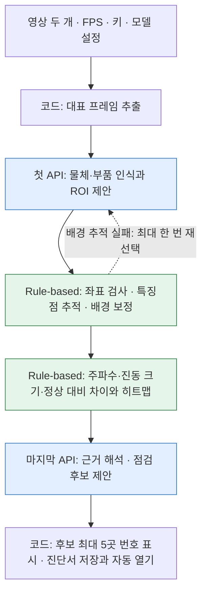

# 영상 진동 비교 · 점검 진단서 프로토타입 (DevDay)

스마트폰 고속 촬영 영상을 비교해 설비의 진동 변화와 점검 후보 위치를 보여주는 해커톤 프로토타입입니다. 현재 예시는 선풍기를 대상으로 하며, **진단 확정이 아닌 점검 보조 도구**입니다.

## 프로젝트 한눈에 보기

- 정상 상태 영상과 점검할 영상, 실제 촬영 FPS, 촬영 조건을 입력합니다.
- 비전 모델이 비교할 부위(ROI)를 제안하고, 로컬 Python 코드가 프레임 추적과 주파수별 움직임 수치를 계산합니다.
- OpenAI 또는 Anthropic 모델이 이미지와 계산 근거를 바탕으로 결과를 구조화해 작성합니다. 모델이 제시한 숫자는 코드가 측정 근거와 대조합니다.
- 웹 화면에는 진행 상태, 정상/비정상/판단 불가 판정, 근거 수치, 후보 위치, 측정 시각화가 표시됩니다.

주요 구성과 해커톤 시작 시점의 사전 구현 범위는 [PREHACKATHON.md](PREHACKATHON.md)에 정리했습니다.

## 웹 프로그램으로 쓰기 (권장)

1. `setup.command`를 더블클릭해 설치합니다 (처음 한 번, 새 버전을 받은 뒤에도 한 번).
2. `settings.py`에서 사용할 공급자(`PROVIDER = "openai"` 또는 `"claude"`), 해당 API 키(`OPENAI_API_KEY` 또는 `ANTHROPIC_API_KEY`), 모델, 영상 FPS를 설정합니다. 예시 설정은 `settings.example.py`에 있습니다.
3. `start_web.command`를 더블클릭하면 브라우저에 `http://127.0.0.1:8000`이 열립니다.
4. 정상 영상과 점검할 영상(240fps 슬로모션 원본)을 올리고 **분석 시작**을 누르면, 진행 상황과 결과(정상/비정상/판단 불가, 근거 수치, 확인할 위치, 부위별 측정값, 측정 화면)를 웹에서 봅니다.

- 같은 와이파이의 휴대폰에서 열려면 터미널에서 `./start_web.command --lan`으로 실행하고 화면에 나온 주소로 접속합니다. 암호가 없으니 믿을 수 있는 네트워크에서만 쓰세요. 아이폰 사진 앱에서 바로 올리면 영상이 변환될 수 있으니, 원본 파일을 올리는지 확인하세요 (30fps 파일이면 경고가 뜹니다).
- **외부에서 접속(URL 공유)**: 터미널에서 `brew install cloudflared`를 한 번 실행한 뒤 `start_public.command`를 더블클릭합니다. 창에 `https://….trycloudflare.com` 주소와 접속 코드가 나오고 `public_url.txt`에도 저장됩니다. 주소를 받은 사람은 접속 코드를 넣어야 들어올 수 있습니다(API 크레딧 보호). 이 창과 Mac이 켜져 있는 동안만 열려 있고, 주소는 실행할 때마다 바뀝니다. 고정 코드를 쓰려면 `settings.py`의 `ACCESS_CODE`에 넣으세요. 외부 주소로는 한 번에 두 영상 합계 95MB까지 올릴 수 있습니다.
- 분석은 한 번에 하나씩 순서대로 처리하며, 결과는 `web_jobs/<분석 ID>/`에 남습니다. 한 번 분석에 AI 호출은 2번(측정 부위 고르기, 판정)입니다.
- API 키는 `settings.py`에만 보관하고 공유하거나 커밋하지 마세요. 해당 파일과 입력 영상, 분석 결과는 Git에서 제외됩니다.

## 팀 공동 사용: GitHub push 자동 배포 (맥 호스트)

개발 맥에서 앱을 호스팅하고 **GitHub Actions self-hosted runner**로 배포합니다. [`deploy_mac.yml`](.github/workflows/deploy-mac.yml)은 `main` 브랜치에 push될 때만 실행되어 [`deploy_mac.sh`](deploy_mac.sh)가 최신 코드를 받고 앱을 재시작합니다. 팀원은 각자 브랜치에서 작업하고 Pull Request를 `main`에 병합하면 됩니다.

### 최초 1회 설정

1. GitHub 저장소의 **Settings → Actions → Runners → New self-hosted runner**에서 macOS / ARM64 안내를 열어 runner를 `~/DevDay-runner`에 설치하고, config 명령에 label `devday`를 등록합니다. 배포용 앱 clone은 `~/DevDay-deploy`에 둡니다.
2. 표시된 GitHub 안내에 따라 runner를 macOS `launchd` 서비스로 설치·실행합니다. 맥이 켜져 있고 사용자가 로그인되어 있으며 인터넷에 연결되어 있어야 합니다.
3. `settings.py`에 `ACCESS_CODE`가 있으면 그 값을 사용합니다. 없으면 배포 스크립트가 접속 코드를 로컬 파일 `~/DevDay-deploy/.devday_access_code`에 생성합니다. 이 파일은 GitHub에 올라가지 않으며, 팀과 안전하게 공유하세요.
4. 저장소 `main`에 커밋을 push합니다. 첫 성공 배포가 웹 앱과 독립 HTTPS 터널을 시작하고 주소를 `~/DevDay-deploy/public_url.txt`와 GitHub **Actions** 로그에 기록합니다. 접속 코드는 Actions 로그에 출력하지 않습니다.
5. 이후 팀원이 `main`에 push/merge하면 앱이 재시작되고, GitHub Actions가 종료된 뒤에도 macOS `launchd`가 앱과 독립 터널을 계속 관리합니다. 같은 로그인 세션에서는 주소가 유지됩니다. Mac 재시작 후 로그인하면 앱과 터널이 자동으로 다시 시작되며 Quick Tunnel 주소는 바뀔 수 있습니다. 최신 주소는 `~/DevDay-deploy/logs/tunnel.log`에서 확인하고, `~/DevDay-deploy/deploy_mac.sh`를 실행하면 `public_url.txt`도 갱신됩니다.

보안상 workflow는 `push`만 처리하며 `pull_request`에서 실행하지 않습니다. 저장소가 공개이므로 self-hosted runner는 공개 PR의 코드를 실행하면 안 됩니다. 팀원은 기본 브랜치에 직접 push하지 말고 PR을 사용하세요. 배포 스크립트는 앱 저장소의 미커밋 변경이 있으면 덮어쓰지 않고 실패합니다. 정상 배포에서는 `settings.py`, `input/`, `web_jobs/` 데이터가 유지됩니다. 앱은 localhost에만 바인딩하고 Cloudflare Quick Tunnel을 통해 접속하므로, 맥이 켜져 있고 사용자가 로그인된 상태여야 합니다.

정상 영상 1개와 이상 여부를 확인할 영상 1개를 넣으면 **API로 ROI 지정 → 로컬 rule-based 측정 → API로 점검 안내 작성**을 수행합니다. 성공하면 진단서를 브라우저에서 자동으로 열고 측정값·이미지·로그는 결과 폴더에 보관합니다.

이 저장소는 2026-10-08 실제 실행한 DevDay 프로그램을 공유한 버전입니다. 기존 수동 ROI 측정 전용 버전은 이전 Git 커밋 이력에 남아 있습니다. 코드는 같은 버전이지만, API의 ROI·진단 응답과 촬영 조건에 따라 결과는 달라질 수 있습니다.

## 처음 실행하는 사람: 초기 설정

### 1. 다운로드와 설치

GitHub의 **Code → Download ZIP**으로 다운로드하고 압축을 해제하세요. **Python 3.12 권장**(코드 최소 3.10), 인터넷 연결이 필요합니다.

macOS에서는 `setup.command`를 더블클릭하세요. 가상환경·라이브러리를 설치하고 키가 비어 있는 `settings.py`를 자동으로 만듭니다. 기존 설정 파일이 있으면 덮어쓰지 않습니다. ZIP 다운로드 후 실행 권한 오류가 나면 폴더에서 터미널을 열어 `zsh setup.command`로 실행할 수 있습니다.

Windows/Linux 또는 터미널 설치:

```bash
python -m venv .venv
# macOS/Linux
.venv/bin/python -m pip install -e .
# Windows에서는 위 명령 대신
# .venv\Scripts\python.exe -m pip install -e .
```

터미널 설치에서는 `settings.example.py`를 `settings.py`로 복사하세요. 실험 당시 라이브러리 버전까지 맞추려면 Python 3.12 환경에서 `requirements.lock.txt`를 먼저 설치한 뒤 `pip install -e . --no-deps`를 사용하세요.

### 2. 영상 두 개 넣기

```text
fan-video-vibration/  (다운로드한 폴더 이름은 달라도 됩니다)
├── input/
│   ├── normal.mp4      ← 정상 상태 영상 1개
│   └── candidate.mp4   ← 이상 여부를 확인할 영상 1개
├── settings.py         ← 본인 설정 (공유하지 않음)
├── run_analysis.command
└── results/            ← 실행할 때 자동 생성
```

기본 경로로 사용하려면 위 이름으로 `input` 폴더에 넣으세요. MOV 파일이면 파일 확장자를 바꾸지 말고 설정 경로를 `input/normal.mov`, `input/candidate.mov`로 변경하세요. 원본의 절대 경로를 지정해도 됩니다. 상대 경로는 현재 터미널 위치가 아닌 프로그램 폴더 기준입니다.

두 영상은 같은 구도·확대율·풍속으로 촬영하세요. 삼각대 촬영을 권장하며 고정 배경의 무늬나 모서리가 충분히 보여야 합니다. 대상은 이상이라고 미리 정답을 지정하는 파일이 아닙니다.

### 3. settings.py의 네 가지 필수 설정

```python
NORMAL_VIDEO = "input/normal.mp4"
CANDIDATE_VIDEO = "input/candidate.mp4"

OPENAI_API_KEY = "본인 API 키를 여기에 입력"

CAPTURE_FPS = 240
CANDIDATE_CAPTURE_FPS = None  # None이면 위와 같은 값

MODEL = "gpt-6-luna"  # 실제 시연 모델

SAME_SPEED = True     # 실제로 두 영상의 풍속이 같을 때만 True
FIXED_CAMERA = True   # 실제로 카메라를 고정했을 때만 True
```

| 설정 | 입력 방법 |
|---|---|
| 영상 경로 | 정상 1개와 비교 대상 1개를 각각 지정 |
| API 키 | [API 키 페이지](https://platform.openai.com/api-keys)에서 발급한 본인 키. [API Billing](https://platform.openai.com/settings/organization/billing/overview)의 사용 가능 잔액도 필요 |
| 모델 | `"gpt-6-luna"`는 이번 시연 모델. 계정에서 사용 가능한 이미지 입력·구조화 출력 지원 모델로 변경 가능 |
| FPS | 저장된 재생 FPS가 아니라 **실제 촬영 FPS**. 예: 스마트폰 240, Canon 179.82. 영상별 값이 다르면 둘 다 입력 |

`MODEL = None`은 저렴한 모델 자동 선택이 아닙니다. 환경변수 `DEVDAY_MODEL`이 없으면 코드 기본 모델 `gpt-6-luna`를 사용합니다. 모델 이름은 따옴표로 감싸고 숫자 FPS는 따옴표 없이 넣으세요.

슬로모션을 30fps로 내보냈어도 실제 촬영이 240fps라면 240을 지정하지만, 이는 내보낸 파일이 연속 촬영 프레임을 보존한다는 조건에 의존합니다. 프로그램이 이를 자동으로 입증하지는 않습니다.

키와 개인 설정이 있는 `settings.py`는 Git에서 제외하며 공개 저장소에는 `settings.example.py`만 제공합니다. 폴더를 직접 전달할 때도 `settings.py`를 제외하세요. 영상·실행 결과·가상환경도 공유 소스에 포함하지 않습니다.

### 4. 실행과 결과 확인

macOS에서는 **`run_analysis.command`를 더블클릭**하세요. `run_demo.command`도 같은 실제 분석을 실행합니다. 키 없는 합성 연결 시험은 별도의 `run_synthetic_demo.command`입니다.

터미널 실행:

```bash
# macOS/Linux
.venv/bin/python run_analysis.py
# Windows
# .venv\Scripts\python.exe run_analysis.py
```

완료되면 **`report.html`이 기본 브라우저에서 자동으로 열립니다.** 전체 자료는 매번 새 `results/analysis-날짜-시간-식별자/` 폴더에 저장됩니다. 실패하면 로그가 남고, 저장된 결과를 가짜 진단으로 대체하지 않습니다.

API에 전송하는 것은 대표 프레임·ROI/히트맵 이미지·측정 JSON입니다. 원본 영상 파일을 직접 전송하지 않습니다. 정상 경로의 API 호출은 2번이며 형식 수정과 배경 ROI 수정은 각각 최대 1번 추가됩니다. 따라서 성공 경로에서 최대 4번 호출하고, 재측정 때문에 실행 시간이 늘어날 수 있습니다.

## 프로그램 역할 구분



첫 API는 **측정할 위치**를 제안하고, rule-based 코드는 **움직임을 계산**하며, 마지막 API는 **점검할 후보**를 해석합니다. 현재 결과는 고장 확정이 아닌 점검 안내입니다. 정상 대비 몇 배면 고장이라는 검증된 판정 기준은 없습니다.

## 상세 사용법과 구현 설명

시연 화면과 독립된 Python 실행 모듈입니다. 휴대폰 앱/모바일 웹/노트북 화면을 결정하면 `run_pipeline()`을 연결하면 됩니다. 현재 웹 서버나 앱 화면은 포함하지 않습니다. 결과 확인용 정적 HTML 보고서는 생성합니다.

## 실행 흐름

1. 정상·대상 영상의 방향을 바로잡은 대표 프레임 추출.
2. 첫 번째 OpenAI API가 부품을 인식하고 정상/대상의 ROI를 구조화 JSON으로 제안.
3. 코드가 좌표·ID·초기 배경 특징점을 검사. 잘못된 제안은 최대 한 번 재제안하며 계속 실패하면 중단.
4. 코드가 대상 영상 첫 프레임을 정상 영상에 정합(ORB+RANSAC 닮음 변환)하고, 정상 ROI를 대상 영상으로 옮긴다. 배율만큼 대상 진폭을 보정한다 (`alignment.json`).
5. Shi-Tomasi → **기준 프레임 대비** LK forward/backward(연쇄 추적 아님) → 밝기 깜빡임 점 제외(보호망 너머 날개) → 전체 구간 생존점 → 아이폰 VFR 타임스탬프 보간 → 배경 보정 → Welch/Hann 분석.
6. 부위별 진동 크기, **배경 잡음 대비 SNR**, 정상 영상 구간 변동 기반 **z점수**, 대표 주파수·첨도 계산. 코드가 규칙 사전판정(`rule_prefilter`: 정상/비정상/판단 불가)을 만든다.
7. 두 번째 OpenAI API가 수치 JSON과 이미지를 보고 **정상/비정상/판단 불가**를 결정하고, 근거 수치를 `decision_basis`로 인용한다.
8. 코드가 인용 수치가 evidence와 일치하는지 검사(불일치 시 1회 재요청)하고, 모델 판단과 규칙 사전판정이 일치할 때만 최종 판정을 낸다 (`decision.json`). 보고서에 판단 근거 수치 표를 넣는다.

정상·대상은 같은 위치·구도·확대율·풍속·설치 상태로 촬영해야 합니다. ROI는 각각의 영상 좌표로 제안하며 동일 구도일 때 동일 좌표를 사용할 수 있습니다. 모델의 'consistent' 평가는 정밀 정합 검증이 아닙니다.

## 설치

Python 3.10 이상. 터미널에서:

```bash
cd /다운로드한/프로젝트/폴더
python3 -m venv .venv
source .venv/bin/activate
python -m pip install -e .
```

macOS에서는 `setup.command`를 실행해도 됩니다. 라이브러리 설치에 인터넷이 필요합니다. 다른 프로젝트 환경을 수정하지 않도록 이 폴더의 가상환경을 사용합니다.

## 설정 파일 + 더블클릭 실행 (권장)

`settings.py`를 열어 다음 항목을 설정하세요.

- `NORMAL_VIDEO`: 정상 상태 영상 하나의 경로.
- `CANDIDATE_VIDEO`: 이상 여부를 확인할 영상 하나의 경로.
- `OPENAI_API_KEY`: 따옴표 안에 본인 키 입력.
- `CAPTURE_FPS`: 실제 촬영 FPS. 두 영상이 다르면 `CANDIDATE_CAPTURE_FPS`도 설정.

기본 경로는 `input/normal.mp4`, `input/candidate.mp4`입니다. 여기에 영상을 복사하거나 설정 파일에 기존 영상의 절대 경로를 넣으세요. MOV 파일도 경로를 바꾸면 사용할 수 있습니다. `SAME_SPEED`, `FIXED_CAMERA`는 실제 촬영 조건에 맞게 설정하세요.

`run_analysis.command`를 더블클릭하면 실제 API → 측정 → API 진단을 실행합니다. 기존 `run_demo.command`도 이제 같은 실제 분석을 실행합니다. 결과는 매번 새 `results/analysis-...` 폴더의 `report.html`에 저장하고, 완료 시 진단서만 기본 브라우저에서 자동으로 엽니다. 세부 측정값과 이미지 등 결과 폴더의 구성은 그대로 유지합니다. 브라우저 실행이 실패해도 저장된 분석 결과는 유지됩니다. 키나 영상/FPS 설정이 없으면 중단하며 예시 응답으로 대체하지 않습니다.

`settings.py`는 Git에서 제외됩니다. 폴더를 직접 공유할 때는 이 파일을 빼거나 키를 지우세요. 키 없는 설정 양식은 `settings.example.py`입니다. 설정 파일과 키는 분석 결과에 복사하지 않습니다.

## 키 없이 전체 연결 확인

```bash
python -m devday demo --out results/demo-001
```

`run_synthetic_demo.command`를 더블클릭해도 됩니다. 합성 영상 두 개와 가짜 모델 응답으로 전체 경로를 실행합니다. 첫·두 번째 모델 단계는 `offline_synthetic`이며 실제 API 추론/실제 선풍기 진단 결과가 아닙니다. 결과 `results/demo-001/run/report.html`을 여세요. 새 출력 폴더를 사용해야 합니다.

## 실제 API + 영상 실행

아래는 터미널 실행을 선호할 때 사용하는 방식입니다. `.env.example`은 안내용이며 자동 로딩하지 않습니다. 더블클릭 실행에서는 위의 `settings.py`를 사용합니다.

```bash
export OPENAI_API_KEY='본인 키'
export DEVDAY_MODEL='gpt-6-luna'
python -m devday run \
  --normal '/경로/정상.mov' \
  --candidate '/경로/비교대상.mov' \
  --capture-fps 240 \
  --same-speed --fixed-camera \
  --out results/experiment-001
```

모델은 `--model` 또는 `DEVDAY_MODEL`로 변경할 수 있으며 이미지 입력과 Structured Outputs를 지원해야 합니다. `--candidate-capture-fps`로 대상 FPS를 별도로 지정할 수 있습니다. 영상 크기는 서로 달라도 좌표가 각각 변환되지만 물리적 크기 보정은 없으므로 비교에는 같은 촬영 조건을 권장합니다.

기본 분석 대역은 1–10Hz 및 10–100Hz(촬영 FPS가 낮으면 Nyquist 아래로 축소)입니다. 특정 주파수를 측정하려면:

```bash
python -m devday run --normal normal.mp4 --candidate candidate.mp4 \
  --capture-fps 179.82 --band low:1:10 --band operating:22:25 \
  --out results/experiment-002
```

대역은 데이터 입력 전에 실험 목적에 맞게 정하세요. 대역/피크를 바꿔 이상 상태가 나오도록 선택하면 안 됩니다. 기본 대역은 범용 탐색이며 선풍기 고장 기준이 아닙니다.

실행하면 대표 프레임·ROI 이미지·히트맵·측정 JSON이 OpenAI로 전송됩니다. MP4/MOV 원본은 API에 직접 보내지 않습니다. 정상 경로는 모델 호출 두 번, ROI 형식/좌표 수정과 배경 추적 실패 수정에 각각 최대 한 번 추가 호출합니다. 두 문제가 모두 발생하면 정상 진단 경로는 최대 네 번 호출합니다. SDK 자동 재시도는 꺼져 있습니다. 인증·네트워크·refusal·출력 잘림은 성공으로 대체하지 않고 오류를 반환합니다. 유효한 비교 근거가 없으면 두 번째 호출을 생략하고 코드가 '판정 불충분' 결과를 저장합니다.

## 저장한 ROI / API 없이 재현

`roi_plan.json`을 검토·수정한 뒤 `--roi-plan 파일`을 사용하면 첫 호출을 생략합니다. 좌표는 **0–1 정규화**, rectangle의 `[x,y,width,height]`입니다. 프로그램이 기존 분석 모듈용 픽셀 좌표로 변환합니다. 프레임의 방향과 크기는 `frames.json`에서 확인하세요. ROI 확장으로 배경/날개를 포함해 추적점을 늘리지 마세요.

대표 프레임만 추출:

```bash
python -m devday prepare input.mov --capture-fps 240 --out results/frames-001
```

저장된 API/테스트 응답으로 네트워크 없이 실행:

```bash
python -m devday run --normal normal.mp4 --candidate candidate.mp4 \
  --capture-fps 240 --provider replay \
  --replay-roi examples/roi_plan.json \
  --replay-diagnosis examples/diagnosis.json \
  --out results/replay-001
```

examples의 ROI는 320×240 합성 영상용이며 실제 선풍기에 그대로 쓰지 마세요. 두 영상의 ROI를 지정한 새 JSON이 필요합니다. replay 보고서는 항상 오프라인 표식을 포함합니다.

## 화면 연결 지점

```python
from devday import run_pipeline

result = run_pipeline(
    reference_video=normal_path,
    candidate_video=candidate_path,
    capture_fps=240,
    output_dir=new_job_directory,
    conditions={"same_speed_confirmed": True, "fixed_camera_confirmed": True},
    on_progress=lambda event: update_ui(event),
)
# result['report_html'], result['visualizations'], result['diagnosis']를 표시
```

함수는 동기식이며 분석 시간이 걸립니다. 웹/앱을 연결할 때 작업 스레드/프로세스에서 실행하고 `status.json` 또는 progress 이벤트로 상태를 표시하세요. 요청마다 고유 출력 폴더를 사용하세요. API 키는 서버/로컬 실행 환경에 보관하고 브라우저에 넣지 마세요. 원본은 읽기만 하며 자동 삭제하지 않습니다. 중간 파일은 ROI 수정·재분석을 위해 보관합니다.

## 결과 파일

- `frames.json`, `frames/`: 실제 저장 FPS와 사용자 촬영 FPS, 대표 프레임.
- `roi_plan.json`: 모델의 부품/ROI 제안. `configs.json`: 픽셀 좌표로 변환한 분석 설정.
- `measurements/reference`, `candidate`: ROI 이미지, 신호·추적 배열, 원 분석 JSON/스펙트럼.
- `alignment.json`: 대상→정상 정합 결과(배율·회전·이동·inlier)와 ROI 이전 여부.
- `evidence.json`: 부위별 진폭·배율·z점수·SNR·배경 잡음 바닥·규칙 플래그(`rule_flag`)·대표 주파수·첨도, 규칙 사전판정(`rule_prefilter`).
- `decision.json`: 최종 판정(정상/비정상/판단 불가), 모델 판단, 규칙 판단, 일치 여부, 인용 수치.
- `visuals/heatmap_*.png`: 두 영상의 같은 색상 척도; 오른쪽은 부위 중앙값 차이. 회색×는 해석 제외. 색상 상한에서 포화될 수 있음.
- `visuals/inspection_roi.png`: 빨간 테두리는 모델의 **점검 후보**, 진동 확정/고장 확정이 아님.
- `diagnosis.json`, `diagnosis.txt`, `report.html`: 최종 추측 진단. `result.json`: UI 연결용 경로/결과.
- `status.json`: 실행 단계. 실패하면 오류 단계와 이유. 실제 호출량은 `result.json`의 `model_calls`에 저장.

## 진단 한계

`assessment`는 `suspected_abnormal`(비정상, `is_abnormal=true`) / `no_clear_difference`(정상, `is_abnormal=false`) / `inconclusive`(판단 불가, `is_abnormal=null`)입니다. 정상·비정상 판단에는 evidence에 있는 수치 인용(`decision_basis`)이 반드시 필요하고, 코드가 값을 대조합니다. 최종 판정은 모델과 규칙 사전판정(SNR ≥ 2, 배율 ≥ 1.5, SNR 배율 ≥ 1.5, z ≥ 3)이 일치할 때만 나오며, 다르면 '판단 불가'입니다. 기준값은 공학적 기본값이며 실제 고장 데이터로 검증되지 않았습니다 (`run_pipeline(rule_thresholds=...)`로 조정). `fault_confirmed`는 항상 false입니다(영상 비교로 고장 원인을 확정할 수 없음). confidence는 확률이 아닙니다.

대표 프레임은 부품 인식용이고 진동 계산은 전체 프레임으로 수행합니다. 촬영 FPS는 사용자가 명시해야 하며 슬로모션/카카오톡 내보내기가 원본 프레임을 유지하는지는 별도 검증이 필요합니다. 수치 단위는 px이며 mm/RPM이 아닙니다. 전체 구간 생존점 3개 이상은 최소 계산 조건일 뿐 충분한 신뢰도를 보장하지 않습니다. 매끄러운 표면·회전 날개·배경 케이블·카메라 안정화/원근·압축/노출 변화가 오차를 만들 수 있습니다. 기존 affine가 실패하면 해당 영상 측정을 실패로 표시하며 임의 보정값으로 대체하지 않습니다. 비교 근거에서 제외된 ROI는 모델 점검 위치로 허용하지 않습니다.

코드는 기존 fan-video-vibration 분석 핵심을 `devday/vendor/fanvib`에 복사해 추적 배열 저장만 추가했습니다. 출처: https://github.com/Kongheechul/fan-video-vibration (MIT). 원 저장소/원본 영상은 수정하지 않습니다.

## 검사

```bash
python -m unittest discover -s tests -v
```

API 포맷 참고: [Images and vision](https://developers.openai.com/api/docs/guides/images-vision), [Structured Outputs](https://developers.openai.com/api/docs/guides/structured-outputs).

## 이번 작성 시 검증

전용 `.venv` 설치 완료. 13개 검사, 실제 SDK의 외부 전송 없는 요청/응답 테스트, 합성 영상 전체 실행, 기존 휴대폰 영상 두 개의 replay 실행을 통과했습니다. 실제 API ROI 인식/진단 성능은 아직 실행하지 않았으며 키와 모델 접근 권한이 필요합니다. `VALIDATION.json`에 범위를 기록했습니다. 이미 생성한 예시는 `results/synthetic-001/run/report.html`, `results/phone-replay-001/report.html`입니다. 후자는 저장 응답 재생이며 새로운 API 진단이 아닙니다. `requirements.lock.txt`는 이번 환경의 설치 버전 기록입니다.

## 일반 사용자용 보고서

`report.html`과 `diagnosis.txt`는 이상 여부를 쉬운 문장으로 안내하고 번호로 표시한 점검 부위와 짧은 확인 방법만 보여줍니다. 정상 대비 수치표, 기술 그래프, 영어 ROI ID, 상세 한계 목록은 사용자 화면에서 제외했습니다. 상세 측정·진단 데이터와 히트맵 파일은 JSON 및 visuals 폴더에 별도로 보관합니다. 기존 결과 HTML도 같은 형식으로 갱신했습니다. 오프라인 예시는 실제 AI 판독이 아니라는 표시를 유지합니다.

## 배경 추적 실패 시 자동 ROI 재선택

배경의 전체 구간 추적점이 부족하거나 배경 변환이 실패하면 실패 이유와 이전 ROI 계획을 API에 보내 배경 ROI를 다시 제안받습니다. 새 좌표를 검사한 뒤 두 영상을 모두 재측정합니다. 형식/좌표 수정 재시도와 별도로 배경 추적 수정용 ROI API 호출을 최대 한 번 허용합니다. 첫 실패 기록은 `roi_attempts/tracking_0`에 보존됩니다. 다시 실패하면 판단 불충분으로 남깁니다. 저장된 ROI를 명시한 실행 및 `--no-roi-retry`에서는 자동 재선택하지 않습니다.
